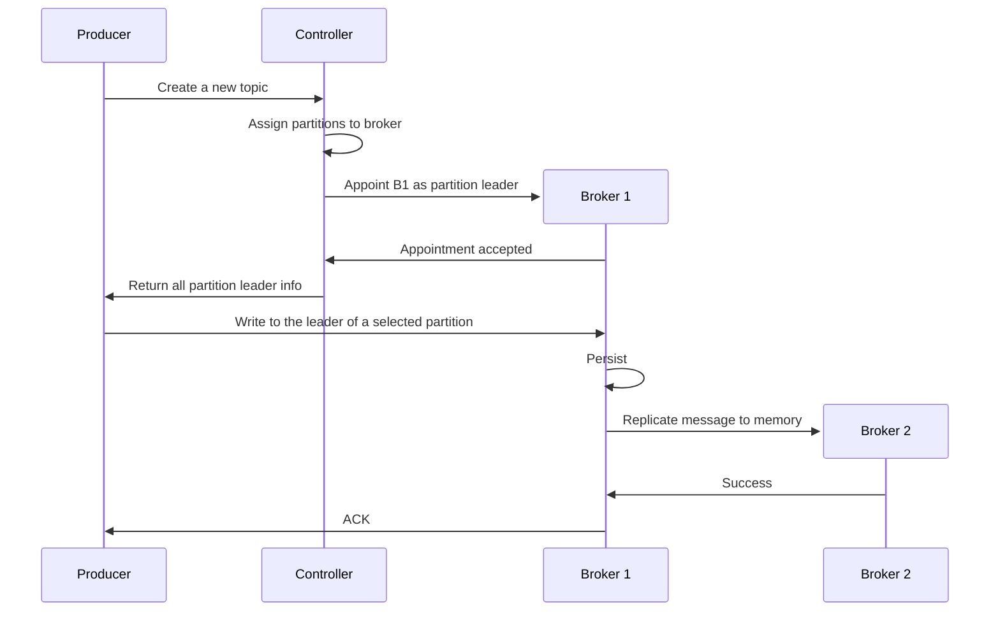
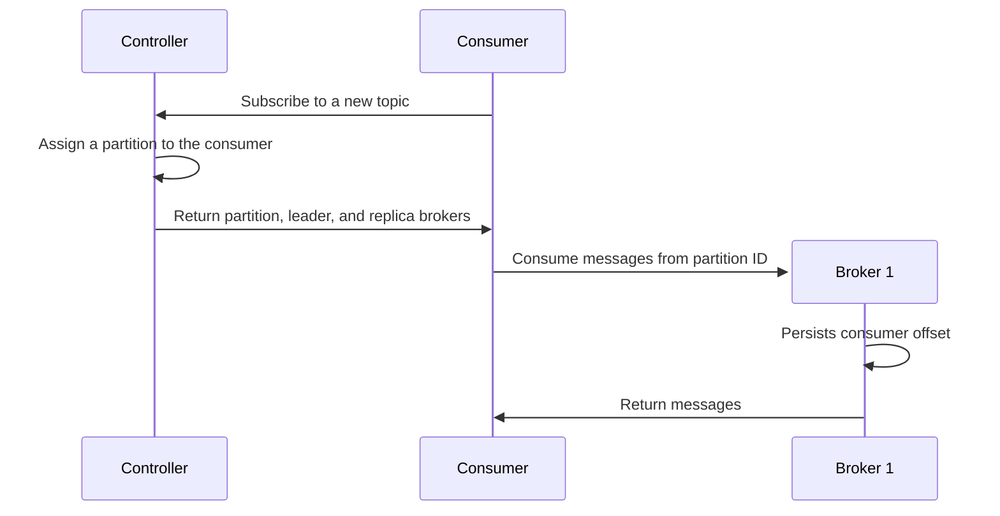

# README

## Write-Path

```mermaid
sequenceDiagram
    participant P as Producer
    participant C as Controller
    P->>C: Create a new topic
    C->>C: Assign partitions to broker
    create participant B1 as Broker 1
    C->>B1: Appoint B1 as partition leader
    B1->>C: Appointment accepted
    C->>P: Return all partition leader info
    P->>B1: Write to the leader of a selected partition
    B1->>B1: Persist
    create participant B2 as Broker 2
    B1->>B2: Replicate message to memory
    B2->>B1: Success
    B1->>P: ACK
    destroy B2
```

## Read-Path

```mermaid
sequenceDiagram
    participant CTRL as Controller
    participant C as Consumer
    C->>CTRL: Subscribe to a new topic
    CTRL->>CTRL: Assign a partition to the consumer
    CTRL->>C: Return partition, leader, and replica brokers
    create participant B1 as Broker 1
    C->>B1: Consume messages from partition ID
    B1->>B1: Persists consumer offset
    B1->>C: Return messages
```
