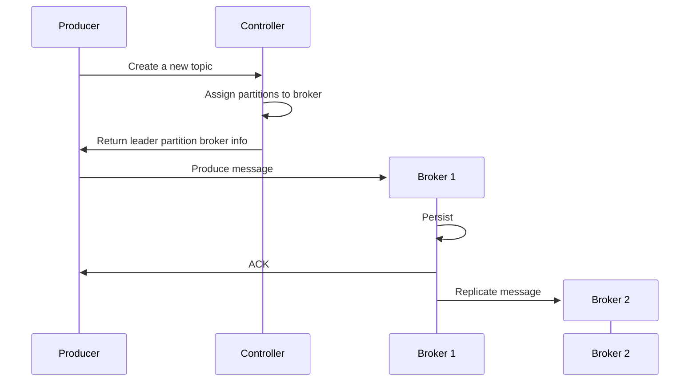

# README

## Write-Path

```mermaid
sequenceDiagram
    participant P as Producer
    participant C as Controller
    P->>C: Create a new topic
    C->>C: Assign partitions to broker
    C->>P: Return leader partition broker info
    create participant B1 as Broker 1
    P->>B1: Produce message
    B1->>B1: Persist
    B1->>P: ACK
    create participant B2 as Broker 2
    B1->>B2: Replicate message
    destroy B2
```